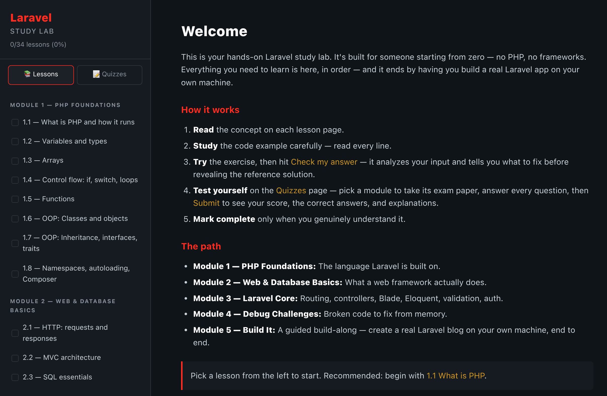

# Laravel Study Lab

> A self-contained, single-page web app that teaches Laravel from scratch — no PHP or framework background required.

## 📖 Overview

Laravel Study Lab is a free, browser-based course that teaches Laravel step by step — from the basics of PHP all the way to building, testing, and deploying a real Laravel app. It's designed for someone starting from zero: everything is laid out in order, and the whole experience runs client-side with no accounts and no setup. Content targets **Laravel 13 / PHP 8.3+**.

The site contains:
- Step-by-step lessons with plain-English explanations
- Worked code examples with syntax highlighting
- Hands-on exercises with automatic answer-checking and reference solutions
- Per-module exams with scoring and explanations
- A guided capstone that builds a real Laravel blog end to end

## ✨ Features

- **Zero setup** — plain HTML/CSS/JS that runs straight in the browser.
- **Smart exercise checking** — type your answer and hit *Check my answer*. It analyzes what you wrote, points out what's missing, and *then* shows the reference solution. It accepts any answer that addresses the problem, not just an exact match.
- **Module exams** — each module's quiz is an exam paper: answer the questions, hit *Submit*, and get a score with the correct answers and explanations. Questions are drawn from a larger bank and shuffled every attempt, so retakes stay fresh.
- **Progress that sticks** — completed lessons and best exam scores are saved in your browser.
- **Polished UX** — syntax-highlighted code, a clean dark theme, and a mobile-friendly responsive layout.

## 📚 Curriculum

| Module | Focus | Lessons |
| --- | --- | --- |
| **1 — PHP Foundations** | Types, arrays, control flow, functions, OOP, interfaces/traits, namespaces, Composer | 8 |
| **2 — Web & Database Basics** | HTTP, MVC, SQL | 3 |
| **3 — Laravel Core** | Install, routing, controllers, Blade, migrations, Eloquent, relationships, validation, auth, middleware | 10 |
| **4 — Debug Challenges** | Fix broken routes, queries, mass-assignment, and Blade | 4 |
| **5 — Build It** | A guided build-along: create a real Laravel blog — setup, Breeze auth, posts, routes, Blade, validation, comments, testing, and deploy | 9 |

> **Module 5 is a build-along** that you follow on your own machine, so it assumes a local toolchain: **PHP 8.3+, Composer, and Node** (for Breeze/Vite assets).

## 🛠️ Tech stack

Vanilla **HTML5, CSS, and JavaScript** — no framework, no build step, no dependencies. All lesson and quiz content lives as plain data in `lessons.js`, and `app.js` renders the interface, runs the exercise checker, and powers the exams.

## 🌐 How to view

**Live site:** https://study-laravel-five.vercel.app/

To run it locally:
1. Download or clone this repository.
2. Open `index.html` in your browser.

## 🔒 Privacy

Nothing leaves your browser. Lesson progress and exam best-scores are stored locally via `localStorage`, and can be cleared anytime with **Reset progress** in the sidebar.

## 📄 License & usage

For educational and demonstration purposes. Laravel and related names are trademarks of their respective owners; any third-party material referenced in the lessons belongs to its owners.

## 🖼️ Preview

